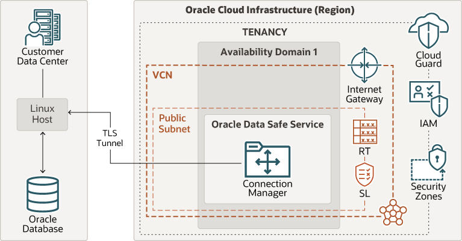

# Data Safe for On-premise Oracle Databases

## Introduction

When you have an on-premises data center, you need a safe and efficient way to manage the day-to-day security of your databases. You can use a secure TLS tunnel from databases to Oracle Cloud and use Oracle Data Safe as a unified control center for your Oracle databases. Oracle Data Safe is designed to help you understand the sensitivity of your data, evaluate risks to data, mask sensitive data, implement and monitor security controls, assess user security, monitor user activity, and address data security compliance requirements.

## Objectives

This workshop comprises various aspects of Data Security. So follow the given sequence to enhance your skills on utilizing Data Safe with on-premise databases. You will learn how to register an on-premise database with the Data Safe Connector. Data Safe also supports FastConnect/IPSec VPN to connect your on-premise location to the Oracle Cloud.

## Reference Architecture

Oracle Data Safe service provides a unified control center to manage the day-to-day security of your Oracle databases. The reference architecture illustrates a typical deployment of Oracle Data Safe to create a secure TLS tunnel from on-premises to Oracle Cloud Infrastructure (OCI). Use this architecture as an example of how to implement Oracle Data Safe to manage your Oracle databases in your on-premises data center.

The following diagram illustrates this reference architecture.

The customer data center has a two way flow of information between a Linux host and an Oracle Database. A TLS tunnel connects the Linux host with Connection Managers in Oracle Data Safe Service in Oracle Cloud Infrastructure.

The Oracle Cloud Infrastructure region has a Tenancy with Oracle Site Guard Cloud Service, Oracle Cloud Infrastructure Identity and Access Management, and Security Zones. The Tenancy has one availability domain and a VCN with an Internet Gateway. Oracle Data Safe and the Connection Managers are located inside a private subnet in the VCN.

## Table of Contents

- [Setup On-premise Connector](networking.md)
- [Register an On-premise Target Database](target-registration.md)
- [Provision Auditing and Alert Policies](auditing.md)
- [Assess Database Configuration and Users](assessments.md)
- [Discover Sensitive Data](discovery.md)
- [Mask Sensitive Data](masking.md)
