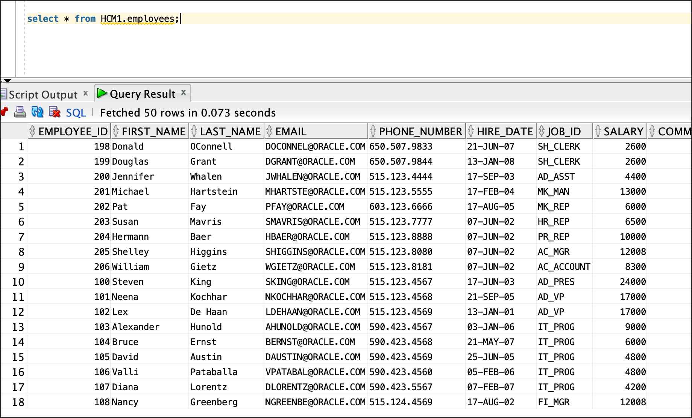

# Discover and Mask Sensitive Data

## Introduction

This lab shows you how to discover and mask sensitive data in your Autonomous Database by using the Data Discovery and Data Masking features in Oracle Data Safe.

Estimated Lab Time: **30 minutes**

## Objectives

In this lab, you'll:

- View sensitive data in your database
- Discover sensitive data in your database by using the Data Discovery feature
- Mask sensitive data in your database by using the Data Masking feature
- Create a PDF of the Data Masking report
- Validate the masked data in your database

## Prerequisites

To complete this lab, you need to have the following:

- An Oracle Cloud account
- Access to an Oracle Database as the `SYS` user, sample data for Oracle Data Safe loaded into the database, and the Discovery and Masking features enabled on your database
- Access to an Oracle Data Safe service
- Privileges to use the Discovery and Masking features on your database

### STEP 1: View sensitive data in your database

In this step, you use SQL Developer to query sensitive data in your database.

```
alter session set container=<YOUR PDB NAME>
```

Next, run the following statem statement

```
select * from HCM1.employees;
```

Review the query results.

- Data such as employee_id, first_name, last_name, email, phone_number, and hire_date, are considered sensitive data and should be masked if shared for non-production use, such as development and analytics.
- Keep this tab open so that you can return to it later. In step 4, you compare the original query results with the masked data.



### STEP 2: Discover sensitive data by using Data Discovery

The Data Discovery wizard generates a sensitive data model that contains sensitive columns in your target database. When working in the wizard, you select the sensitive types that you want to discover in your target database.

1. Return to the browser tab for the Oracle Cloud Infrastructure Console. If needed, sign in again.
2. From the navigation menu, select **Data Safe**. The **Overview** page for the Oracle Data Safe service is displayed.
3. Click **Service Console**. The **Home** page in the Oracle Data Safe Console is displayed.
4. To access the Data Discovery wizard, click the **Data Discovery** tab.
5. On the **Select Target for Sensitive Data Discovery** page, select your target database, and then click **Continue**.


6. On the Select Sensitive Data Model page, leave Create selected, enter SDM1 for the name, enable Show and save sample data, select your compartment, and then click Continue.


