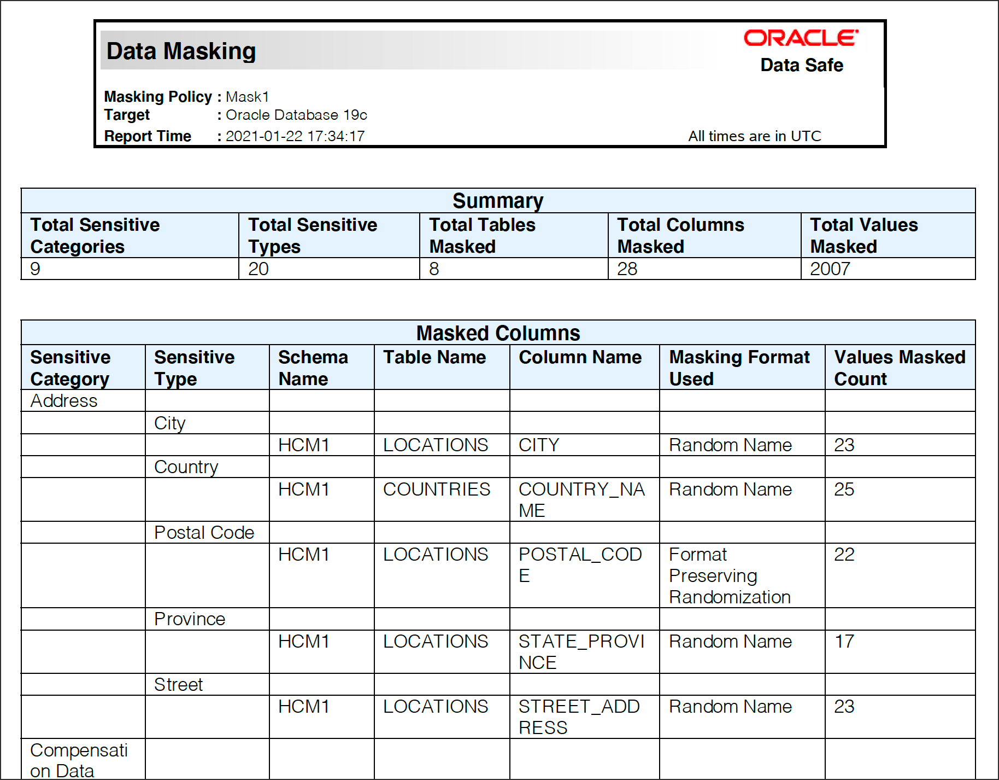

# Masking Sensitive Data with Data Safe

## Objectives

In this lab you'll:

- Mask sensitive data in your database by using the Data Masking feature
- Create a PDF of the Data Masking report
- Validate the masked data in your database

## Prerequisites

## Prerequisites

To complete this lab, you need to have the following:

- An Oracle Cloud account
- Access to an Oracle Database as the `SYS` user, sample data for Oracle Data Safe loaded into the database, and the Discovery and Masking features enabled on your database
- Access to an Oracle Data Safe service
- Privileges to use the Discovery and Masking features on your database

### **Step 1:** Mask sensitive data by using Data Masking

1. Return to the browser tab for the Oracle Cloud Infrastructure Console. If needed, sign in again.
2. From the navigation menu, select **Data Safe**. The **Overview** page for the Oracle Data Safe service is displayed.
3. Click **Service Console**. The **Home** page in the Oracle Data Safe Console is displayed.
4. To access the Data Discovery wizard, click the **Data Masking** tab.
5. On the **Select Target for Sensitive Data Discovery** page, select your target database, and then click **Continue**.


6. On the Masking Policy page, move the Expand All slider to the right to view all of the sensitive columns. Scroll down the page and review the default masking format selected for each sensitive column.


7. On the **Select Masking Policy** page:
 - Click the create button under **Masking Policy**
 - Under **Masking Policy Name** enter **Mask1**
 - Under **Sensitive Data Model** select the **Pick from Library** button. In the next page we will pick the sensitive data model that we created in the [**Discover Sensitive Data**](discovery.md) lab.
 - Pick the compartment that you would like to user then click **continue** at the bottom of the page.


 8. On the **Select Sensitive Data Model** page select **SDM1**
 9. Click **Update the SDM with Target** then click **Continue**.


10. Click **Continue** once the **Sensitive Data Discovery** is complete


11. Notice that only newly discovered sensitive columns will be displayed on the  **Sensitive Data Model: SDM1** page


12. Click **View all sensitive columns**. Notice All Sensitive Columns are now available.


13. Click **Save and Continue**

14. On the **Masking Policy** page, move the **Expand All** slider to the right to view all of the sensitive columns. Scroll down the page and review the default masking format selected for each sensitive column.


15. For the `HCM1.LOCATIONS.STREET_ADDRESS` column, click the arrow to the right of the masking format to view other masking formats.


16. Next to the arrow, click the Edit Format button (pencil icon).


17. In the **Edit Format** dialog box, review the details for the masking format, including the datatype, description, examples, and default configuration. This is where you can modify a masking format, if needed. Click **Cancel**.

 

18. At the bottom of the page, click **Confirm Policy**.
19. Wait a moment while Data Masking creates the masking policy.
20. On the **Schedule the Masking Job** page, leave Right Now selected, and click **Review**.

  

21. On the **Review and Submit** page, review the information, and then click **Submit** to start the data masking job.


22. Wait for the data masking job to finish. It takes a couple of minutes. You can follow the status of the job on the Masking Jobs page.
23. When the job is finished, click **Report**.


dsjfsldkjfsdlkjl


24. Examine the **Data Masking** report.
 - At the top of the report, you can view the number of masked values, masked sensitive types, masked tables, and masked columns.
 - The table shows you column counts for the sensitive categories and types. For each sensitive column, you can view the masking format used and the number of rows masked.


### **STEP 2:** Create a PDF of the Data Masking report

1. At the top of the report, click **Generate Report**. The **Generate Report** dialog box is displayed.


2. Leave **PDF** selected.
3. Enter **Mask1_HCM1** for the description.
4. Select your compartment.
5. Click **Generate Report** and wait for the report to generate.

 

6. When a confirmation message states that the **Report was generated successfully**, click **Download Report**.
7. Save the report and then open it in Adobe Acrobat.
8. Review the data, and then close the report.

 

### **STEP 5:** Validate the masked data in your database

1. Return to SQL Developer. You should have a worksheet open from the previous lab.


2. Next, re-run the following statement

```
select * from HCM1.employees;
```

3. If you receive a message stating that your session has expired, click OK, sign in again, and then re-ren the statement.
4. Review the masked data. You can resize the panel to view more data, and you can scroll down and to the right.


