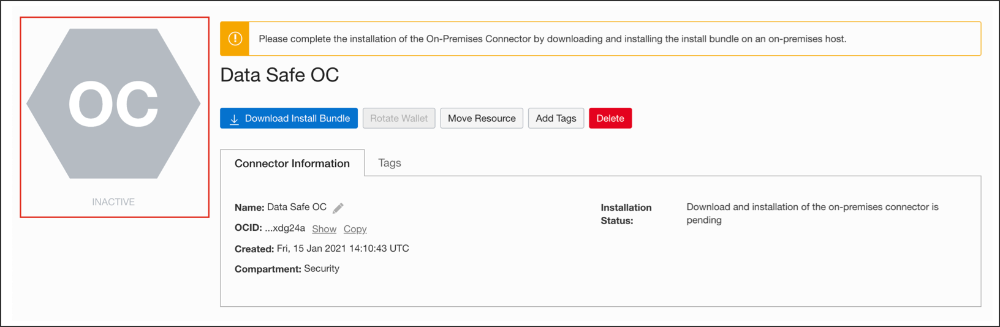
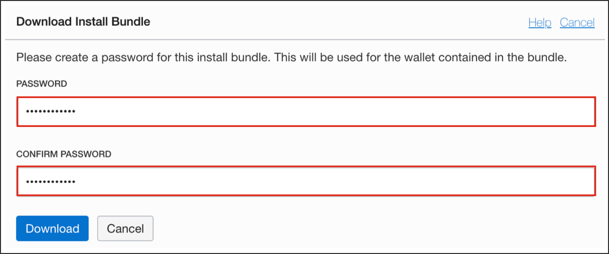
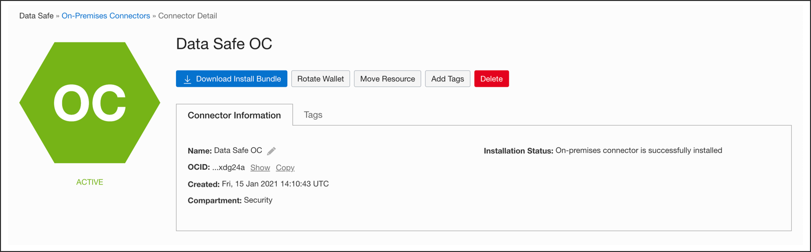

# Connect your Database with On-premise Connector

There are various ways by which you can connect your on-premises location to Oracle Cloud Infrastructure OCI. You have a choice between FastConnect, IPSec VPN and the On-premise Connector.

- **FastConnect:** FastConnect enables a private and dedicated connection your on-premise location and Oracle Cloud Infrastructure. FastConnect supports bandwidths from 1Gbps to 10Gbps. [Learn more about FastConnect](https://www.ateam-oracle.com/fastconnect-design)

- **IPSec VPN:** IPSec VPN is a site-to-site IPSec virtual private network that securely connects your on-premises network to Oracle Cloud Infrastructure, using your existing internet connection. VPN Connect is the easiest and fastest way to connect your on-premises network and your Oracle virtual cloud network (VCN) using IPSec tunnels over the internet. [Learn more about IPSec VPN](https://www.ateam-oracle.com/vpn-connect-simpe-implementation-part-12)

- **Data Safe Connector:** The On-premise connector is an easy and convenient way to connect Oracle Data Safe to your on-premises Oracle database without needing FastConnect or VPN Connect. In steps below, you will learn how to download and install the on-premise connector on your on-premise host machine.

### **STEP 1**: Sign in to the Oracle Data Safe Console

1. If you are already signed in to the Oracle Data Safe Console, click the **Oracle Data Safe** tab in your browser.
2. If you are not signed in to the Oracle Data Safe Console, do the following:

    a) Click the browser tab named **Oracle Cloud Infrastructure**, and sign in to the Console if needed.
    b) From the navigation menu, select **Data Safe**. The **Overview** page for the Oracle Data Safe service is displayed.
    c) Click **Service Console**. The **Home** tab in the Oracle Data Safe Console is displayed.

### **STEP 2**: Create an On-premise connector

1. Select Data Safe from the navigation menu


2. Under Connectivity Options, click **On-Premises Connectors**.
3. On the right, click **Create On-Premises Connector**. The Create On-Premises Connector page is displayed.


4. Enter a name for the on-premises connector.
5. (Optional) Enter a description for the on-premises connector.
6. Click **Create On-Premises Connector**. The on-premises connector is created and listed in the table.


7. The initial life-cycle state of the on-premises connector is set to **INACTIVE**.



### **STEP 3**: Download the Install Bundle for the On-Premises Connector

Before we install the On-premise connector your host should have the following minimum requirements:

- Operating system: **Oracle Linux 7** or higher
- **Python 3.5** or higher
- **Java version 7** or higher with a valid Java Home `(JAVA_HOME)`

Download the install bundle for the on-premises connector from the Connector Detail page in the Oracle Data Safe service.

1. From the Data Safe page in Oracle Cloud Infrastructure, click **On-Premises Connectors**.

2. Click the on-premises connector that you created. The **Download Install Bundle** dialog box is displayed.



3. Enter a password for the install bundle, confirm it, and then click Download.
4. Keep this password on hand as you need it later when you install the on-premises connector on a host on your network.
5. The install bundle is downloaded to your browser's default download location.
6. Unzip the bunddle and run the following command

```
python setup.py install --connector-port=1560
```

7. At the prompt, enter the password that you created when you downloaded the install bundle.
8. The on-premises connector is installed in the current directory and automatically started. The status for the on-premises connector in the Oracle Data Safe service in Oracle Cloud Infrastructure is now set to **ACTIVE**



**Congratulations!** You have successfully installed the Data Safe Connector. In the next lab, you'll [register an on-premise target database](target-registration.md) with Data Safe
