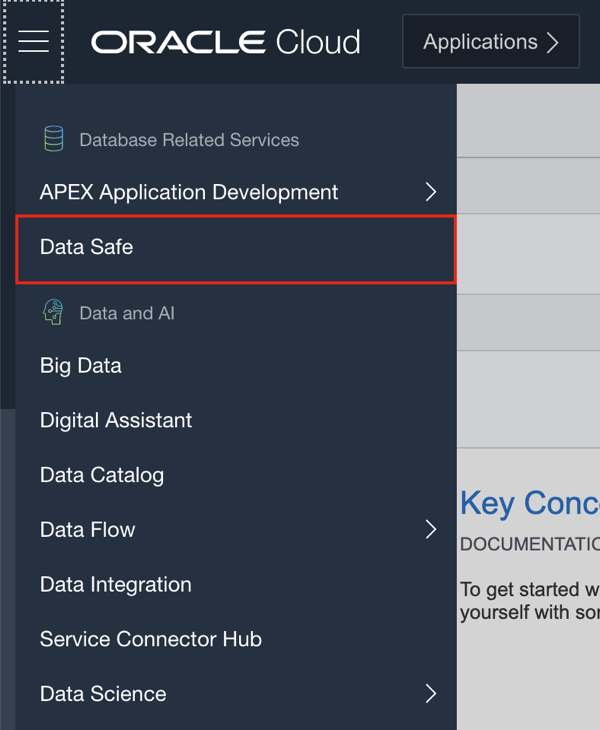
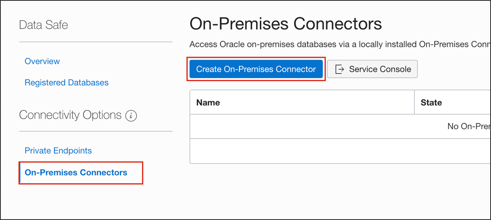

# Connecting to OCI using Data Connector

There are various ways by which you can connect your on-premises location to Oracle Cloud Infrastructure OCI. These include FastConnect, IPSec VPN, and the Oracle Data Safe Connector. Using Oracle Data Safe's on-premises connector is an easy and convenient way to connect Oracle Data Safe to your on-premises Oracle database without needing FastConnect or VPN Connect.

## FastConnect

FastConnect is a way to create a private connection between customer on-prem and Oracle Cloud Infrastructure. FastConnect supports bandwidths from 1Gbps to 10Gbps. There are three FastConnect options to choose from Oracle Provider, Third-Party Provider, and Colocation. The purpose of this blog is to help/guide you to choose the best option taking in consideration important points in the design. This blog focuses on design, for configuration and enablement, refer to the public documentation for FastConnect where you will find detail instructions for each option.

[Learn more about FastConnect](https://www.ateam-oracle.com/fastconnect-design)

## IPSec VPN

VPN Connect in Oracle Cloud Infrastructure is a site-to-site IPSec virtual private network that securely connects your on-premises network to Oracle Cloud Infrastructure, using your existing internet connection. VPN Connect is the easiest and fastest way to connect your on-premises network and your Oracle virtual cloud network (VCN) using IPSec tunnels over the internet. It uses industry standard IPSec protocol suite that encrypts the entire IP traffic before the packets are transferred from the source to the destination.

[Learn more about IPSec VPN](https://www.ateam-oracle.com/vpn-connect-simpe-implementation-part-12)

## **STEP 1**: Sign in to the Oracle Data Safe Console

1. If you are already signed in to the Oracle Data Safe Console, click the **Oracle Data Safe** tab in your browser.

2. If you are not signed in to the Oracle Data Safe Console, do the following:

    a) Click the browser tab named **Oracle Cloud Infrastructure**, and sign in to the Console if needed.

    b) From the navigation menu, select **Data Safe**. The **Overview** page for the Oracle Data Safe service is displayed.

    c) Click **Service Console**. The **Home** tab in the Oracle Data Safe Console is displayed.

## **STEP 2**: Create an On-premise connector

1. Select Data Safe from the navigation menu

2. Under Connectivity Options, click On-Premises Connectors.
3. On the right, click Create On-Premises Connector. The Create On-Premises Connector page is displayed.

4. Enter a name for the on-premises connector.
5. (Optional) Enter a description for the on-premises connector.

6. Click Create On-Premises Connector. The on-premises connector is created and listed in the table. The initial life-cycle state of the on-premises connector is set to INACTIVE.
