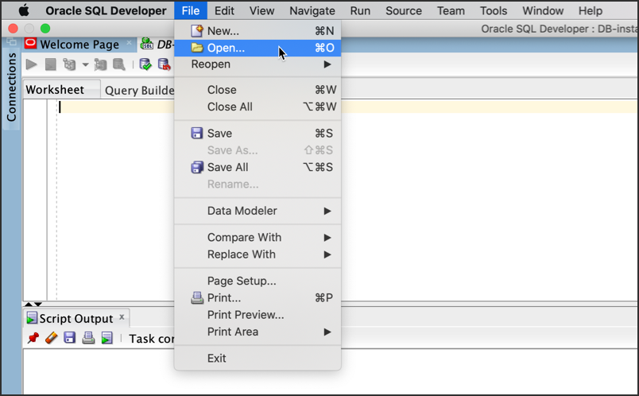

# Register an On-premise Target Database

### **STEP 1**: Sign in to the Oracle Data Safe Console

1. If you are already signed in to the Oracle Data Safe Console, click the **Oracle Data Safe** tab in your browser.
2. If you are not signed in to the Oracle Data Safe Console, do the following:
  * Click the browser tab named **Oracle Cloud Infrastructure**, and sign in to the Console if needed.
  * From the navigation menu, select **Data Safe**. The **Overview** page for the Oracle Data Safe service is displayed.
  * Click **Service Console**. The **Home** tab in the Oracle Data Safe Console is displayed.

### **Step 2:** Create a Service Account for Data Safe

Before we register our database let create a Data Safe service account in our on-premise database.

1. Log in to your target database with an account that lets you create a user.
2. Create a user account with minimal privileges, for example:

  ```
  alter session set container=<YOUR-PDB>;

  CREATE USER DS$ADMIN identified by password
  DEFAULT TABLESPACE "DATA"
  TEMPORARY TABLESPACE "TEMP";
  GRANT CONNECT, RESOURCE TO DS$ADMIN;
  ```

- Replace password with your own values.
- Do not use `SYSTEM` or `SYSAUX` as the default tablespace. You cannot mask data if you use these tablespaces.

### **Step 3:** Grant Roles to the Service Account

1. From the Data Safe menu click the **Targets** menu

  

2. From the **Targets** page click **Register**. The **Register Target** dialog will pop up.
3. Click **Download Privilege Script**

  

4. The `datasafe_privileges.sql` is downloaded on your local computer. Click **Cancel** to exit the **Register Targets** dialog.
5. With SQL Developer, connect to your database as `SYS` user.
6. From the SQL Developer menu to go File > Open.

  

7. Locate your `datasafe_privileges.sql` script and open the file.
Run the script.

  

8. On the **Select Connection** dialog, select your Database under connection then click **OK**.

  

9. Enter the Data Safe User `DS$ADMIN` for the Value 1. `DS$ADMIN` is the name of the Oracle Data Safe service account that you created on your DB system. It is case-sensitive and must match the account name in the `dba_users` data dictionary view in your database. Click **Ok**.

  

10. You can `GRANT` or `REVOKE` depending on whether you want to add privileges to or remove privileges from the Oracle Data Safe service account. Type **Grant** for value 2

  

11. You can assign `AUDIT_COLLECTION`, `AUDIT SETTING`, `DATA_DISCOVERY`, `MASKING`, `ASSESSMENT`, or `All`  privileges to the `DS$ADMIN` users. For the purposes of this workshop we will assign `All` the privileges. Type **All** for Value 3

  

12. Your DS$AMIN user has now been granted the following privileges:
- `AUDIT_COLLECTION`
- `AUDIT SETTING`
- `DATA_DISCOVERY`
- `MASKING`
- `ASSESSMENT`


- Optional, you can can the same script using SQL*Plus

```
@dscs_privileges.sql DS$ADMIN GRANT ALL;

```

### **Step 4:** Register an On-Premises Oracle Database

1. Sign in to the Oracle Data Safe Console.
2. Click the **Targets** tab.
3. Click **Register**. The **Register Target** dialog box is displayed.
4. Enter a name for your on-premises Oracle database. This name can be any name you want, and all characters are accepted. The maximum number of characters is 512.
This name appears in all of the Oracle Data Safe reports that pertain to your target database.
5. For target type, select **Oracle On-Premises Database**.
6. (Optional) Enter a description for your target database.
7. Select the compartment to which you want your target database to belong.
You can add a target database to only one compartment and you cannot change the compartment after the target database is registered.

8. From the **Connection Type** drop-down list, select **On-Premises Connector**.
9. From the **On-Premises Connector** drop-down list, select the name of the on-premises connector that you created in the Oracle Data Safe service in Oracle Cloud Infrastructure.
10. From the drop-down menu, select **TCP**.

11. For **Hostname/IP Address**, enter the host name or IP address of your on-premises Oracle database.
12. For **Port Number**, enter the port number of your on-premises Oracle database.
13. For **Database Service Name**, enter the long-form service name of your on-premises Oracle database.
Enter the database user name and password that you created on your on-premises Oracle database specifically for theOracle Data Safe service.
14. If you created the user without quotation marks, you need to enter the user name in uppercase here. For example, if the user name on the target database is called test, then you need to enter TEST.
You cannot specify database roles, such as `SYSDBA` or `SYSKM`, and you cannot specify SYS as the user.
15. (Optional) To verify that Oracle Data Safe can successfully connect to your on-premises Oracle database, click **Test Connection**.
Click **Register Target**.

 

16. You cannot register the target database if the connection test fails or if the on-premises Oracle database does not exist.

 
